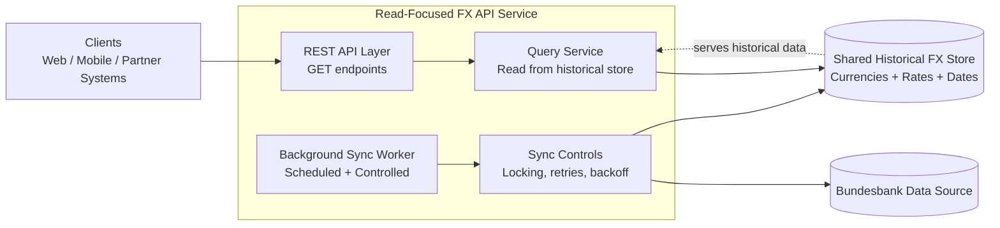

# FX API High-Level Architecture

## Notes
- Request path is read-optimized: API queries the shared historical store.
- Synchronization is decoupled from client requests and runs in background.
- Sync controls protect the upstream provider and keep data ingestion stable.