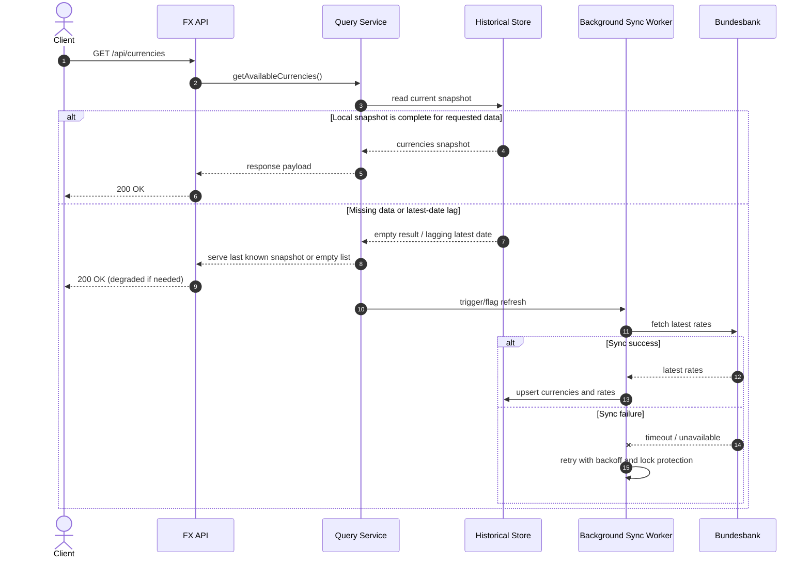

# FX API Runtime Flow (Cache and Sync)

## Notes
- Client reads stay fast and independent from upstream availability.
- Sync runs in the background with controlled retries and locking.
- Historical rows are immutable by date; sync closes missing dates and latest-date lag.