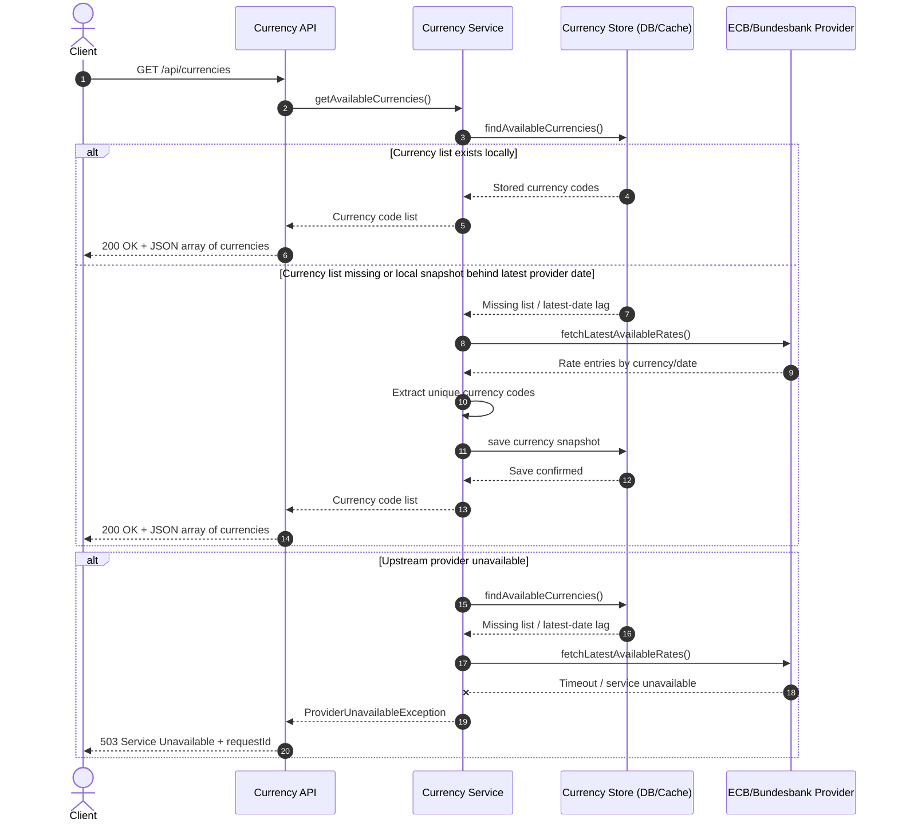

# List Available Currencies Sequence Diagram

```mermaid
sequenceDiagram
    autonumber
    actor Client
    participant CurrencyAPI as Currency API
    participant CurrencyService as Currency Service
    participant CurrencyStore as Currency Store (DB/Cache)
    participant RateProvider as ECB/Bundesbank Provider

    Client->>CurrencyAPI: GET /api/currencies
    CurrencyAPI->>CurrencyService: getAvailableCurrencies()
    CurrencyService->>CurrencyStore: findAvailableCurrencies()

    alt Currency list exists locally
        CurrencyStore-->>CurrencyService: Stored currency codes
        CurrencyService-->>CurrencyAPI: Currency code list
        CurrencyAPI-->>Client: 200 OK + JSON array of currencies
    else Currency list missing or local snapshot behind latest provider date
        CurrencyStore-->>CurrencyService: Missing list / latest-date lag
        CurrencyService->>RateProvider: fetchLatestAvailableRates()
        RateProvider-->>CurrencyService: Rate entries by currency/date
        CurrencyService->>CurrencyService: Extract unique currency codes
        CurrencyService->>CurrencyStore: save currency snapshot
        CurrencyStore-->>CurrencyService: Save confirmed
        CurrencyService-->>CurrencyAPI: Currency code list
        CurrencyAPI-->>Client: 200 OK + JSON array of currencies
    end

    alt Upstream provider unavailable
        CurrencyService->>CurrencyStore: findAvailableCurrencies()
        CurrencyStore-->>CurrencyService: Missing list / latest-date lag
        CurrencyService->>RateProvider: fetchLatestAvailableRates()
        RateProvider--xCurrencyService: Timeout / service unavailable
        CurrencyService-->>CurrencyAPI: ProviderUnavailableException
        CurrencyAPI-->>Client: 503 Service Unavailable + requestId
    end
```